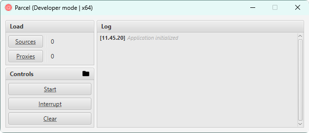

<h3 align = "center">
    
</h3>

---

### About

Parcel is a brute-force tool, which can be very easily configured for different purposes. Currently it confirmed as IMAP mail brute-force tool.
This project uses concurrent architecture, with synchronization on common resources. Also it can save results into text files.
All control logic is very generic and needs no change, when you want configure this software for your own automatisation purposes.
This project can be used only in educational purposes, on your own accounts! The author is not responsible for your dangerous actions.

**All features tested on:** `Windows` `Linux`

    
    <h6 align = "center">Preview Image</h6>

---

### Installation
    Create your own jar

    1. Clone the project
    2. Import project in your IDE as Maven project
    3. Add Chillkat repository to your .m2 folder
    4. Fill all sensitive data, such as Chillkat license key and IMAP server configuration
    5. mvn clean package

 

    Run jar file

    1. Create you own jar as described above
    2. Make shure you have Java 8 installed and JAVA_HOME is setted
    3. Execute jar on Windows or Linux with administrative rights
